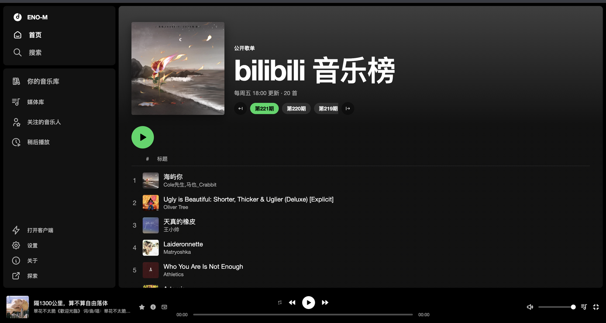
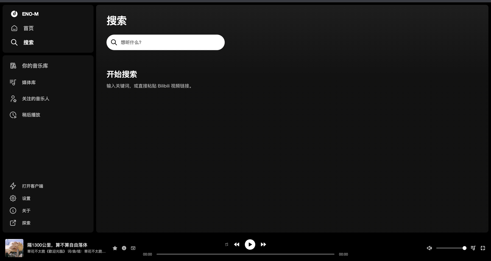
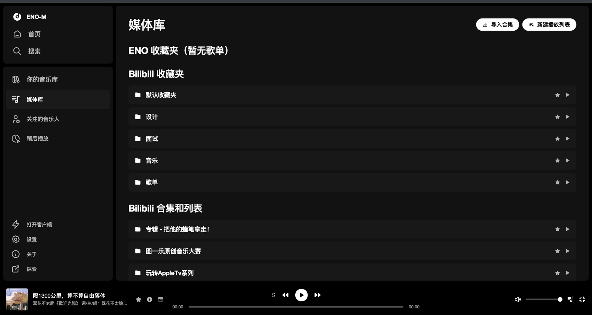
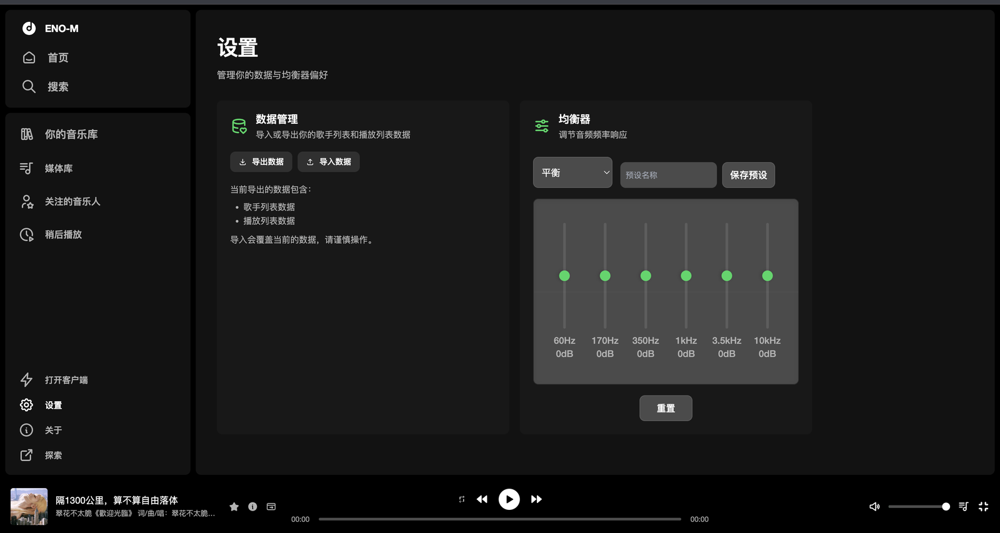

<p align="center">
  
</p>

<h1 align="center">ENO-M</h1>

<p align="center">把 bilibili 当音乐播放器 —— 深色全页体验 + 工具栏迷你控制</p>

<p align="center">
  <a href="https://chromewebstore.google.com/detail/eno-m/hjcdffalgapcchmopkbnkljenlglloln?hl=zh-CN"><strong>Chrome 应用商店</strong></a>
  ·
  <a href="https://afdian.com/a/meanc">爱发电</a>
  ·
  <a href="https://discord.gg/HPv2WDrvhq">Discord</a>
</p>

## 这是什么

ENO-M 是一个 Chrome 扩展，用 Spotify 风格的深色界面收听 bilibili 音视频：侧栏浏览、底栏播放、工具栏弹窗遥控。支持关注音乐人、自建歌单，以及把登录态一键带到桌面端。

当前版本：**5.2.0**

<p align="center">
  
</p>

<p align="center">
  
  
</p>

<p align="center">
  
  
</p>

## 功能

- **首页**：bilibili 音乐榜、继续听、关注歌手速览
- **搜索**：关键词或 BV 链接；最近搜索、时长 / UP 筛选
- **媒体库**：ENO 歌单（侧栏直达、去重 / 打乱 / 重命名）；登录后同步 B 站收藏夹 / 合集
- **关注的音乐人**：mid / 空间链接，或导入 B 站关注
- **稍后播放 / 最近播放**：临时队列和播放历史
- **底栏播放器**：循环、倍速、睡眠、音量、进度、歌词、队列；封面打开全屏视频；EQ、分享卡片
- **收藏**：ENO 歌单，或直接写入 / 新建 B 站收藏夹
- **工具栏 Popup**：封面 / 可拖进度 / 音量 / 上一首·播放·下一首、循环、倍速、睡眠；打开完整页。音频在 Offscreen 中播放，关完整页可续播
- **设置**：备份（歌单、稍后播放、历史、均衡器）、打开客户端、关于
- **打开客户端**：把 bilibili cookie 带到 [桌面端](https://github.com/cloudflypeng/eno-m-desktop)

## 路线图

**5.2** 已发出：关页续播、Popup 遥控（音量 / 循环 / 倍速 / 睡眠 / 进度）、快捷键、失败重试、新建 B 站收藏夹。

下一主题在歌词无字幕退路和桌面端双向里二选一。TypeScript 7、再加一种视频形态、未达门槛的手机版，先不做。

## 使用

1. 从 [Chrome 应用商店](https://chromewebstore.google.com/detail/eno-m/hjcdffalgapcchmopkbnkljenlglloln?hl=zh-CN) 安装
2. 建议在浏览器中登录 bilibili，以便同步收藏夹与合集
3. 点击扩展图标打开 **迷你控制**，或点「打开完整播放器」进入全页界面
4. 在完整页点歌后即可播放；关闭完整页后可用工具栏继续控制

## 本地开发

```bash
pnpm install
pnpm dev
```

然后打开 `chrome://extensions` → 开启开发者模式 → 「加载已解压的扩展程序」→ 选择仓库里的 `extension/` 目录。

```bash
pnpm build   # 生产构建
pnpm pack    # 打包 zip / crx
pnpm test    # 单元测试
```

## 相关链接

| | |
| --- | --- |
| Chrome 商店 | https://chromewebstore.google.com/detail/eno-m/hjcdffalgapcchmopkbnkljenlglloln |
| 桌面端 | https://github.com/cloudflypeng/eno-m-desktop |
| 爱发电 | https://afdian.com/a/meanc |
| Discord | https://discord.gg/HPv2WDrvhq |
| QQ 群 | https://qm.qq.com/q/jeLnZehRyo |

## 贡献者

<a href="https://github.com/cloudflypeng/eno-music/graphs/contributors">
  
</a>

Made with [contrib.rocks](https://contrib.rocks).
